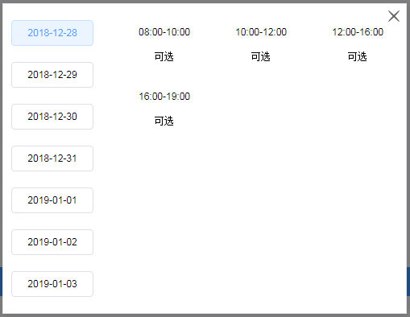

<script>
  module.exports = {
    data(){
      return {
        superability:{ 
            "val":{
                "storeCode":"A007", //门店代码
                "storageCode":"BXVT01", //仓库代码
                "deliveryCount":"1",//送货数量
                "deliveryDate":1545840000000,//送货日期
                "townCode":"110102002"   // 四级区域码  
                },
                "typereq":"openBill",//openBill 导购单页调用   otherpage其他是建档页调用
               "type":"delivery"       // 必填 送货能（运能）delivery  安装能 installAbility
            }
      }
    },
    methods: {
      changed(changeend){
        console.log(changeend)
      },
      show1(){
         // 送货能参数
        let superability={ 
            "val":{
                "storeCode":"A007", //门店代码
                "storageCode":"BX0101", //仓库代码
                "deliveryCount":"1",//送货数量
                "deliveryDate":1545840000000,//送货日期
                "townCode":"110102002"   // 四级区域码  
                },
            "typereq":"otherpage",//openBill 导购单页调用   otherpage其他是建档页调用
            "type":"delivery"       // 必填 送货能（运能）delivery  安装能 installAbility
          }
        this.superability=superability;  //重新赋值 触发组件的watch
      },
      show2(){
        
        let superability2={ 
            "val":{
                "brandCode":"00023",  //brandCode
                "categoryCode":"R0301002", // 线下四级品类代码
                "commerceItemId":"45574404",//商品唯一号
                "installCount":"1",//安装数量
                "installDate":1545840000000,//安装日期
                "saleOrgCode":"1001",//销售组织代码
                "skuNo":"100253548",//商品编码
                "townCode":"110102002",//四级区域
                "queryType":0 //0：首次查询  1：修改查询    当修改建档查询返回的安装方式为安装时，传1，其余时候传0
                },
            "typereq":"otherpage",//openBill 导购单页调用   otherpage其他是建档页调用
            "type":"installAbility",       // 必填 送货能（运能）delivery  安装能 installAbility
             "limittime":{
                        "star":"",
                        "end":"",
                        "datatime":""
                    }
          }
        this.superability=superability2;  //重新赋值 触发组件的watch
      }
    }
  };
</script>

## g-delivery 运能组件

常用于中台页面调用运能安能组件

### 基础用法
显示运能安能组件组件

<div class="demo-box">
  <div class="demo-block">
    <div @click="show1" style="cursor: pointer">点击显示运能</div>
    <br/>
    <div></div>
    <br/>
    <br/>
    <div @click="show2" style="cursor: pointer">点击显示运能</div>
    <g-delivery v-model="superability" @changed="changed"></g-delivery>
    <br/>
    <div></div>
  </div>
</div>

:::demo 
```html
<template>
<div class="demo-box">
  <div class="demo-block">
    <div @click="show1" style="cursor: pointer">点击显示运能</div>
    <br/>
    <br/>
    <br/>
    <div @click="show2" style="cursor: pointer">点击显示运能</div>
    <g-delivery v-model="superability" @changed="changed"></g-delivery>
  </div>
</div>
</template>
<script>
  export default {
  data(){
      return {
         superability:{ 
            "val":{
                "storeCode":"A007", //门店代码
                "storageCode":"BXVT01", //仓库代码
                "deliveryCount":"1",//送货数量
                "deliveryDate":1545840000000,//送货日期
                "townCode":"110102002"   // 四级区域码  
                },
                "typereq":"openBill",//openBill 导购单页调用   otherpage其他是建档页调用
               "type":"delivery"       // 必填 送货能（运能）delivery  安装能 installAbility
        }
      }
    },
    methods: {
      changed(changeend){
        console.log(changeend)

       let   changeends={ //返回的对象
                  st:changeend.st, //开始时间 8：00 //点击关闭之后返回"close"
                  et:changeend.et, //结束时间 10：00
                  code:changeend.code, //该时段对应的代码
                  able:changeend.able;//0 约满 1可选 2 紧张 3 送按一体
                  time:changeend.time, //选中的日期
                  sayt:changeend.sayt,//区域是否支持
                  type:changeend.type, //类型 送货能（运能）delivery  安装能 installAbility 区分后续操作
                  installSite:changeend.installSite,  //type 为 installAbility时  返回安装网点
                  installArea:changeend.installArea, //type 为 installAbility时  返回安装区域
                  installCompanyCode:changeend.installCompanyCode,  //type 为 installAbility时返回售后公司代码  
             }

      },
      show1(){
         // 送货能参数
        let superability={ 
            "val":{
                "storeCode":"A007", //门店代码
                "storageCode":"BXVT01", //仓库代码
                "deliveryCount":"1",//送货数量
                "deliveryDate":1545840000000,//送货日期
                "townCode":"110102002"   // 四级区域码  
                },
            "typereq":"otherpage",//openBill 导购单页调用   otherpage其他是建档页调用
            "type":"delivery"       // 必填 送货能（运能）delivery  安装能 installAbility
          }
        this.superability=superability;  //重新赋值 触发组件的watch
      },
      show2(){
        
        let superability2={ 
            "val":{
                "brandCode":"00023",  //brandCode
                "categoryCode":"R0301002", // 线下四级品类代码
                "commerceItemId":"45574404",//商品唯一号
                "installCount":"1",//安装数量
                "installDate":1545840000000,//安装日期
                "saleOrgCode":"1001",//销售组织代码
                "skuNo":"100253548",//商品编码
                "townCode":"110102002",//四级区域
                "queryType":0 //0：首次查询  1：修改查询    当修改建档查询返回的安装方式为安装时，传1，其余时候传0
                },
            "typereq":"otherpage",//openBill 导购单页调用   otherpage其他是建档页调用
            "type":"installAbility",       // 必填 送货能（运能）delivery  安装能 installAbility
             "limittime":{
                        "star":"",
                        "end":"",
                        "datatime":""
                    }
          }
        this.superability=superability2;  //重新赋值 触发组件的watch
      }
    }
  }
</script>
```
:::

### Attributes
| 参数      | 说明          | 类型      | 可选值                           | 默认值  |
|---------- |-------------- |---------- |--------------------------------  |-------- |
| val | 请求的参数 | object  | — | — |
| typereq| 调用页面的类型 | string  | — | — |
| type| 调用能的类型 | string  | — | — |
| limittime| 波次时间段儿过滤(现不用前端过滤) | object  | — | — |


### Events
| 事件名 | 说明 |
| ---- | ---- |
| changed | 点击选完波次的操作 |
