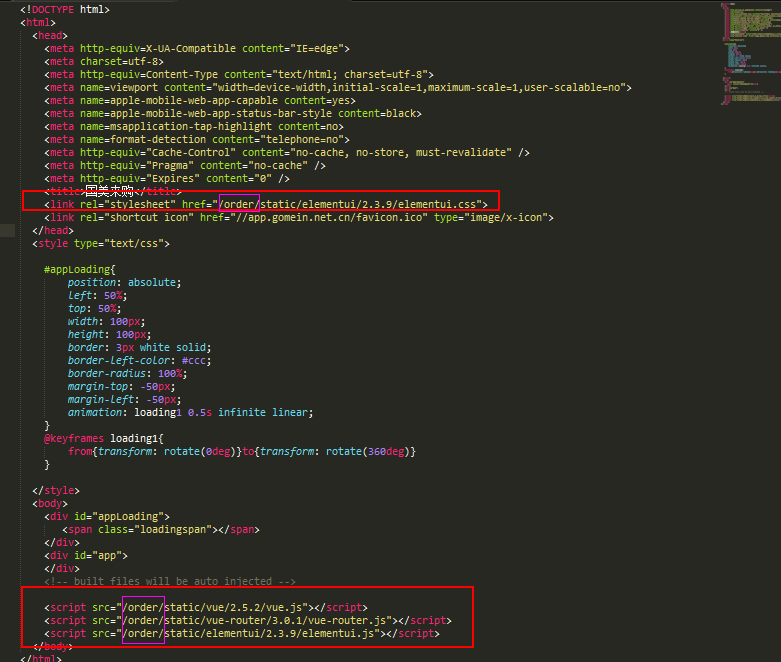
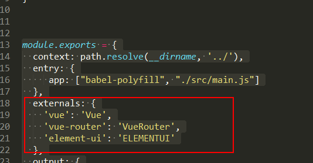

# 来购项目优化 

----


- 异步引入公共资源（因线下门店有可能没外网 所以把公共资源全部放在项目内，不走cdn）

- gzip开启（暂时不用）
- productionSourceMap (暂时不用关)
----

# 异步加载公共资源 

### copy公共资源到各自项目static文件下
url: 
<a target="_blank" href="https://code.ds.gome.com.cn/svn/atg_poc/30_Coding/NewDevMode/branches/gome-gfe-platform/order-platform/order-platform_1.0.3_BR/static" >
	https://code.ds.gome.com.cn/svn/atg_poc/30_Coding/NewDevMode/branches/gome-gfe-platform/order-platform/order-platform_1.0.3_BR/static
</a>

### 修改webpack相关配置
<div style="color:red">

1、config/index.js

dev: {

    assetsSubDirectory: 'order/static',


 2、build/utils.js

 exports.assetsPath = function (_path) {

	  const assetsSubDirectory = (process.env.NODE_ENV === 'production' ||process.env.NODE_ENV === 'uatdevelopment' )
	    ? config.build.assetsSubDirectory
	    : config.dev.assetsSubDirectory

  return path.posix.join(assetsSubDirectory, _path)

}
</div>

### index.html文件顶部header加载
<div style="color:red;font-size:20px;">引入路径中带项目关键字<br/><br/> /order/ <br/> /member/ <br/>/service/</div><br/>


```html
   <link rel="stylesheet" href="/order/static/elementui/2.3.9/elementui.css"> 
```
### 底部加载

`<script src="/order/static/vue/2.5.2/vue.js"></script>`

`<script src="/order/static/vue-router/3.0.1/vue-router.js"></script>`

`<script src="/order/static/elementui/2.3.9/elementui.js"></script>`
<div></div>

# 修改build/webpack.base.conf.js 文件

```html
  externals: {
    'vue': 'Vue',
    'vue-router': 'VueRouter',
    'element-ui': 'ELEMENTUI'
  },

```
<div></div>


# 注释相关公共资源import引入

### src\main.js、src\router\index.js、src\store\index.js 等其他文件如果有以下js片段需要注释
```html
src\main.js文件
	//import Vue from "vue"
	//import ElementUI from 'element-ui'
	//import 'element-ui/lib/theme-chalk/index.css'
src\router\index.js 文件
	//import Router from 'vue-router'
	把之前的 Router 全部改为   VueRouter;
	Vue.use(VueRouter);
	let router = new VueRouter({
	  mode: 'history',
	  routes: [
	  	.
	  	.
	  	.
src\store\index.js  文件
	//import Vue from "vue"
```